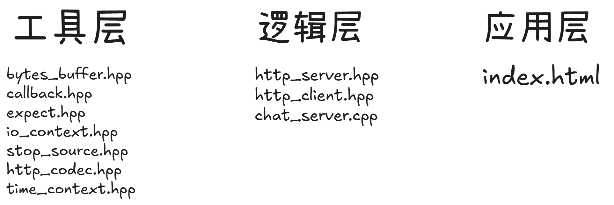

+++
date = '2026-04-23T18:59:50+08:00'
draft = false
title = 'c++17异步服务器'
slug = "cpp17-async-server"  
+++
# 总体复盘阶段
### 一 项目的运行流程
###### &emsp;&emsp;整个项目的入口在chat_server.cpp中，通过一个server()函数进行服务器的初始化以及启动。在main函数中通过server()进行调用。接下来对server()进行分析

&emsp;&emsp; 首先是**注册路由**和**创建io操作的实例**（包括epoll等等），有 '/' , '/send' , '/recv'等等,每个路由都代表了一种”动作”吧，例如使用send时，客户端向服务器发送的消息，而recv则是客户端接受了服务器的消息。然后是启动服务器，即 server().do_start();这个函数相当于启动了服务器，把创建套接字，绑定地址，监听网卡，操作accept的队列，这几个操作封装在了一起。当从accept队列中成功连接一个后，会调用connection_handler进行处理后面的信息。详细内容在此不再赘述，后面会对每个模块进行详解。

### 二 项目的整体结构
&emsp;&emsp;我将这个项目分为工具层，逻辑层，应用层。
很明显，工具层就是保存数据，回调函数，异常处理等。
逻辑层包括http_server和http_client
应用层就是index.html了

### 三 每个模块的功能
bytes_buffer.hpp:相当于一个缓冲区，存储请求或者响应的相关信息，里面包含视图，可读视图等减少开销
callback.hpp:回调函数
expect.hpp:异常处理
io_context.hpp:io操作的相关方法
stop_source.hpp:取消令牌，处理超时以及取消连接的情况
http_codec.hpp:内有处理头部信息的相关方法
time_context.hpp:计时器的实现
http_server.hpp:服务器的组装
http_client.hpp:客户端的组装
chat_server.cpp:主函数入口
index.html:前端文件
后面的文章会对这几个文件里面的内容进行详细复盘
### 四 学到了什么知识（最重要!!!）
bytes_buffer.hpp: 